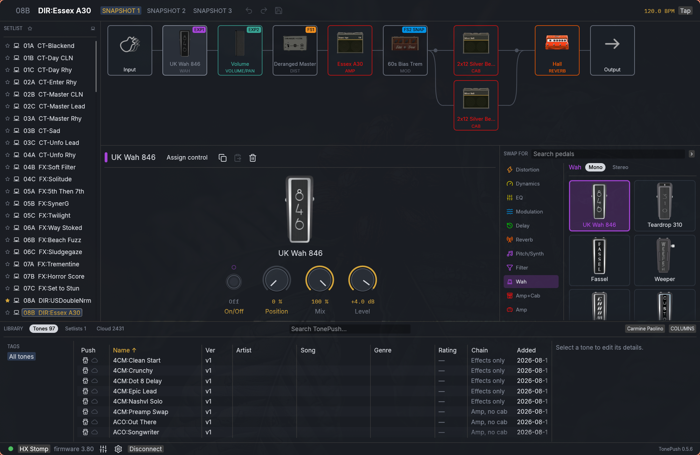

# TonePush

[](https://github.com/crmne/tonepush/actions/workflows/ci.yml)
[](LICENSE)

An open-source editor for Line 6 HX-family devices and the Sonulab
StompStation PRO: one cross-platform GUI, one scriptable CLI, and reusable
protocol/client crates behind both. Hardware-tested against an HX Stomp on
firmware 3.80 and a StompStation PRO on firmware 1.5.12.



Nothing here is derived from vendor source code. The HX protocol was
reconstructed by observing USB traffic; see [PROTOCOL.md](PROTOCOL.md) for the write-up,
[docs/_reference/opcodes.md](docs/_reference/opcodes.md) for the operation dictionary, and
[docs/_reference/model-catalog.md](docs/_reference/model-catalog.md) for the data formats HX Edit
ships.

## What it does

For HX devices, everything HX Edit does on an HX Stomp, verified operation by
operation against the hardware:

- **The signal chain, laid out like your pedalboard.** Splits branch the line and joins
  merge it, one lane per branch, with the endpoints showing where they are
  routed. Drag the fork or merge along the line to move where the path
  divides. Devices with two DSP paths get up to four lanes.
- **Editing.** Swap any block's model from a searchable thumbnail browser, turn
  knobs with values formatted exactly as HX Edit formats them, bypass blocks,
  reorder the chain, clear slots.
- **Presets.** Select, rename, **save**, copy, paste, import, export, and back
  up a whole setlist to a directory. A preset travels as the device's own
  document byte for byte, so nothing is lost in translation; re-encoding is
  verified byte-exact against a captured preset on every test run.
- **Editing the document.** Copy a block over another slot, copy a snapshot's
  settings while keeping its name, reorder, clear, and undo. The preset carries
  a directory of byte offsets into itself, so these were impossible until that
  table was decoded and could be recomputed.
- **Snapshots, setlists, tempo.** Switch, rename, and edit them.
- **Device settings.** The global namespace HX Edit's preferences write to,
  readable and writable by id (`tonepush setting`, `set-setting`).
- **Impulse responses.** Drop a WAV on the window; upload, list and clear
  verified end to end, including the checksum.
- **`.hlx` files.** Applied as ordinary parameter edits with a `--dry-run`
  preview, so a bad file costs one parameter, not the preset.
- **Live activity.** The editor follows what you do on the front panel.

For the StompStation PRO, TonePush keeps the same preset-list, signal-chain,
model-shelf and pedal-knob design instead of reproducing VoidX Control's UI:

- **Native live editing.** The pedal describes its own fixed chain and every
  control. TonePush validates edits against that live schema, while using the
  same colored block tiles, category art and knob grid as the HX editor.
- **All device libraries.** Select, save, rename, reorder, import, export and
  clear presets; manage NAM amp and drive models; import/export mono IRs or
  pair two slots as a stereo WAV. Uploads are acknowledged chunk by chunk and
  read back in full before success is reported.
- **Verified backup and restore.** A private `.vxbundle` holds exact padded
  bytes for presets, both IR channels and every NAM slot plus safe global
  settings. Every size and SHA-256 is checked before use. Persistent GUI edits
  stay disabled until a current rollback bundle matches the connected pedal;
  the newest matching bundle is armed automatically on connection. Refreshes
  reuse unchanged verified slots, and full reads batch strictly validated
  chunks instead of waiting for one USB round trip per chunk.
- **Conservative compatibility.** Reads work with self-described protocol
  data; writes are enabled only for the exact identity and firmware verified
  on hardware (`StompStation PRO`, CM4, `sspro`, firmware 1.5.12).

See [the StompStation PRO guide](docs/_guide/stompstation-pro.md) for the GUI,
CLI, file formats and rollback workflow. The independent VoidX implementation
uses the vendor's [public protocol documentation](https://www.voidxdevteam.com/voidx-control/voidx-protocol/)
and captures from our own device; no GPL client code is copied into TonePush.

Two things often assumed missing are not HX Edit features on an HX Stomp: the
tuner lives on the hardware, and Command Center is inert on a three-switch
device.

Every question the protocol write-up opened has an answer in it now, down to
the flag that turned out to mean "the tempo is not mine to set", identified by
patching its reply in flight and watching HX Edit's own display change. The
[PROTOCOL.md](PROTOCOL.md) write-up has the reasoning, the dead ends, and the
methods; what remains marked open needs a Helix Floor or LT on the bench, since
those opcodes are inert on an HX Stomp.

## Installing

Grab a binary from the [releases page](https://github.com/crmne/tonepush/releases)
for macOS, Windows and Linux, x86-64 and arm64, or build from source:

```sh
./install.sh
```

That builds everything, puts `tonepush` on your PATH, and installs the editor:
a double-clickable app on macOS, a desktop entry on Linux.
`./install.sh --cli-only` skips the GUI, `--uninstall` removes it all again.

On Linux it also installs a udev rule, because without one a normal user cannot
open a USB device and the resulting permission error looks like a bug in this
program. Replug the device afterwards.

Building needs [Rust](https://rustup.rs). On Linux the GUI additionally needs
the X11/Wayland development packages any egui application does. On Debian or
Ubuntu: `libxkbcommon-dev libwayland-dev libgl1-mesa-dev`.

### HX model names and pictures

Names, parameter ranges, value formatting and artwork come from HX Edit's own
data files, which are Line 6's and are **not** redistributed here. The editor
walks you through this on first launch: it copies from an installed HX Edit
automatically, and otherwise takes the HX Edit installer you download from
[line6.com/software](https://line6.com/software/), either the Mac .dmg or the
Windows .exe. Reading an installer needs 7-Zip on Linux and Windows
(`p7zip` on most distros); macOS uses its own hdiutil and pkgutil.

The same extraction exists as a script, for scripted setups:

```sh
tools/hxresources/extract.sh HX_Edit_3.82.dmg   # or the .exe
```

Everything degrades gracefully without this: the device still works, you just
see model numbers instead of names and no pictures.

## Using it

**Quit HX Edit first.** It claims the vendor USB interface exclusively, and so
does this; only one editor can talk to the device at a time.

```sh
tonepush list             # find attached devices
tonepush info             # identity and firmware
tonepush presets          # every preset by name
tonepush select 7         # load index 7, which the device labels 03B
tonepush chain            # the signal chain, named, with values
tonepush topology         # the chain as it is wired, one row per branch
tonepush set 4 Drive 5.0  # set a parameter by name, in displayed units
tonepush enable 4 off     # bypass a block
tonepush snapshot 2       # switch snapshot
tonepush move 4 5         # reorder blocks
tonepush save             # commit the edit buffer; without this, edits are lost
tonepush backup tone.bin  # the loaded preset, byte for byte
tonepush restore tone.bin # and back again
tonepush backup-all dir/  # every preset in the setlist, one file each
tonepush copy-block 1 3   # copy a block over another slot
tonepush copy-snapshot 1 2
tonepush route 0 "Return" # route an input or output
tonepush setting 203      # read a device setting; set-setting writes
tonepush export tone.json # human-readable export, for diffing
tonepush import a.hlx --dry-run   # preview an .hlx; needs no hardware
tonepush rename 7 "New Name"
tonepush watch            # stream front-panel activity
tonepush models           # browse the catalog; needs no hardware
tonepush-gui              # the editor
```

StompStation PRO commands live under `tonepush pro`, so the two devices'
different slot conventions cannot be confused:

```sh
tonepush pro info
tonepush pro list presets
tonepush pro select 1
tonepush pro set 'root\app\amp\gain' 42
tonepush pro export amps 1 my-amp.nam
tonepush pro export-stereo-ir 1 2 room.wav
tonepush pro backup stompstation.vxbundle
```

Run `tonepush pro --help` for the guarded import, save, rename, move, clear and
restore commands.

Preset indices are zero-based within a setlist: index 7 is `03B`. Parameter
values are typed in the units HX Edit displays (`5.0` on a knob shown 0..10,
`100` on a percentage, `Limit` on a switch) and converted for you.

The CLI also decodes captured USB logs with no hardware attached:

```sh
tonepush decode captures/01-connect-and-sync.log
```

## The workflow

The pedal is where you make a tone, because it is where you hear it. The library
is where tones live afterwards, on your computer, outliving any slot on any
device. A setlist is a whole pedal kept as one thing.

That gives a loop worth naming:

1. **Make a tone on the pedal.** Swap blocks, turn knobs, reorder the chain. The
   editor writes the pedal's scratch buffer, so everything is audible at once
   and nothing is permanent until you save.
2. **Keep the ones worth keeping.** Each preset in the list has a button that
   copies it into your library, whole: the device's own document, so the
   snapshots and the routing come too.
3. **Build a setlist.** Get the pedal holding the presets you want, in the order
   you want, then click the computer icon in the SETLIST header. That records
   every slot the connected pedal provides and what is in it.
4. **Play it back.** One button puts a setlist onto the pedal again, or you can
   send a single preset out of one into the slot it came from.

Changing a setlist later means putting it back on the pedal, editing there,
keeping the changed tones to the library, and capturing a new setlist. A setlist
is not edited in place. That is deliberate: it is a record of a rig that worked
on a particular night, and a record you can edit is not a record.

Nothing in the library is a lock-in. Tones are byte-exact pedal preset
documents in a plain folder, and setlists are small JSON files beside them. A
Tone can be written out as `.hlx` for Line 6 or `.vxpreset` for the PRO (the
TonePush extension for VoidX's raw preset payload), with a manifest that keeps
its Song facts and device-native Tone facts separate. Publishing creates the
Song first, then adds the Tone.

## Layout

| Crate | What it is |
|---|---|
| `crates/hx-proto` | Pure codec: framing, channels, MessagePack RPC, preset documents. No I/O, no dependencies. |
| `crates/hx-catalog` | Reads HX Edit's model catalog for names, ranges and value formatting. |
| `crates/hx-usb` | USB transport built on [`nusb`](https://crates.io/crates/nusb). Owns the session and its bookkeeping. |
| `crates/voidx-proto` | Pure NUL-frame/VoidX command, schema, preset and blob codec. No I/O. |
| `crates/voidx-client` | Transport-independent ordered session, serial discovery, typed PRO operations, conversion and verified backup/restore. |
| `crates/tonepush-cli` | The `tonepush` command-line application, using the protocol/client crates below it. |
| `crates/tonepush-gui` | The shared TonePush editor design plus device-specific HX and PRO workers, on egui/eframe. |

The `hx-` prefix is descriptive, the protocol layer *for HX devices*, the way
`rust-openssl` describes what it talks to. `hx-proto` has no dependencies at
all, which keeps it usable from a test, a capture decoder, or an Android shim
without dragging a transport along.

| Platform | State |
|---|---|
| macOS, Linux, Windows | Works. HX uses pure-Rust `nusb`; the PRO uses its USB CDC serial port. |
| Android | Reachable but not wired up: the USB Host API hands over a file descriptor, which `nusb` can adopt, and the GUI already runs on eframe. |
| iOS | Not possible. The protocol lives on a vendor USB interface, and iOS gives third-party apps no raw USB access, and none of it is reachable over class-compliant MIDI either. |

## Updating dependencies

Dependency updates are an explicit local maintenance action, not a scheduled
bot. Start with a clean working tree and run:

```sh
./tools/update-dependencies.py
```

The command raises direct Cargo and Ruby constraints across incompatible
release lines, refreshes both lockfiles, updates the pinned Rust and Ruby
toolchains and numeric GitHub Action versions, then runs the Rust tests and
lints, builds and loads the Ruby gem, and builds the documentation. Review the
result with `git diff` before committing it. If an incompatible update needs a
source migration, the failed check and all dependency changes are left in the
working tree to fix together. `--no-verify` is available when only the update
step is wanted.

## Handle with care

StompStation PRO persistent operations require an explicit confirmation and a
verified rollback bundle representing the pedal's current state. TonePush
keeps backups private because the self-described schema can include sensitive
system values. A timeout poisons the ordered session: reconnect before another
command rather than guessing where the firmware's reply stream is.

For Line 6 devices, these units can lock up hard enough to need their **9V
adapter pulled**; a USB replug is not enough:

An HX device is externally powered and keeps its
session across re-enumeration. When it happens, HX Edit cannot connect either.

Every lock-up during development traced back to the client, not the hardware,
and each cause is now understood, avoided, and pinned by a regression test: the
big one was leaving the device nowhere to put the notifications it streams
unasked, which silently backs up its queues until writes time out. Never call
USB reset either: the device leaves the bus and does not come back.
[PROTOCOL.md](PROTOCOL.md) has the full post-mortem, including how to tell a
wedged device from a stale host-side backlog that looks identical.

The unit tests need no hardware. The twelve that exist to keep your device safe
do:

```sh
cargo test -p hx-usb -- --ignored --test-threads=1
```

They drive the device the way the editor does (reading in a loop, sweeping a
knob, clicking through blocks, switching presets and snapshots, IR round trips,
writing preset documents back), each ending by asserting the device still
answers on both channels, and some by reconnecting from scratch.
`--test-threads=1` is not optional: the device serves one session at a time.

## Reverse-engineering tools

`tools/hxsniff` captures HX Edit's own traffic. macOS on Apple Silicon cannot
sniff USB without disabling SIP, so instead it interposes the libusb that HX
Edit bundles, which yields exact message boundaries and complete buffers. It
works on a *copy* of the app bundle and never modifies the installed one.

```sh
tools/hxsniff/run.sh                                   # launch instrumented HX Edit
tools/hxsniff/act.sh "LABEL" 426 120                   # click, tagging the capture
tools/hxsniff/decode.py      ~/.cache/hxsniff/hxsniff.log --stats
tools/hxsniff/reassemble.py  ~/.cache/hxsniff/hxsniff.log --chan 1080:03ed
tools/hxsniff/attribute.py   ~/.cache/hxsniff/hxsniff.log
```

`capture.sh` runs a whole scenario end to end: it launches the instrumented
editor, walks you through the clicks one at a time, and marks the log before
each one so `attribute.py` can say which messages a given click produced.

```sh
bash tools/hxsniff/capture.sh backup     # a full read  (opcode 109)
bash tools/hxsniff/capture.sh restore    # a full write (op 109's inverse)
bash tools/hxsniff/capture.sh ir         # IR import, export, copy, clear
bash tools/hxsniff/capture.sh globals    # every device setting HX Edit exposes
bash tools/hxsniff/capture.sh enums      # the value lists those two only sampled
bash tools/hxsniff/capture.sh partition  # restore one kind of object at a time
bash tools/hxsniff/capture.sh library    # favorites, setlists, preset files
bash tools/hxsniff/capture.sh assign     # the Bypass/Controller Assign page
DRY=1 bash tools/hxsniff/capture.sh ir   # read the steps through first
```

The IR scenario imports the probe files `make-irs.py` writes - a ramp whose
every sample encodes its own index, a staircase of powers of two, a stereo pair
with the channels opposite in sign, and one file over both the length and rate
limits - so sample bytes are identifiable in a reply stream we cannot yet frame.

`tools/midiprobe` and `tools/usbprobe` cover the MIDI and USB-descriptor sides;
`tools/hxpower` power-cycles a wedged device through a Home Assistant smart
plug, which pairs well with the hardware test suite. The `captures/` directory
holds the annotated captures the protocol documentation was reconstructed from.

## Packaging maintenance

Release packaging uses the [native-packages](https://rubygems.org/gems/native-packages) gem. macOS release builds automatically sign and notarize when the Apple CI credentials are configured. `native-packages.yaml` declares packages and downstream repositories; native recipes and installation assets live in `packaging/`; see [PACKAGING.md](PACKAGING.md) for local commands and CI behavior.

## License

MIT. See [LICENSE](LICENSE).

"Line 6", "Helix", "HX Stomp" and "HX Edit" are trademarks of Yamaha Guitar
Group. This project is not affiliated with or endorsed by them; the names are
used only to describe the hardware it talks to.

## Prior art

- [`kempline/helix_usb`](https://github.com/kempline/helix_usb): Python; the
  deepest previous effort, and the first to find the multi-channel structure.
- [`allansomensi/openhx`](https://github.com/allansomensi/openhx): Rust; lists
  and selects presets.
- [`AntonyCorbett/HelixBackupFiles`](https://github.com/AntonyCorbett/HelixBackupFiles)
  and [`frankdeath/hx-tools`](https://github.com/frankdeath/hx-tools): file
  formats.
