# TonePush Editor redesign, 2026-10-01

A redesign of every surface of the TonePush Editor for the Line 6 HX family and
the Sonulab StompStation PRO, with the PRO's chain designed for firmware 2.x.
It is a proposal: no Rust code has changed. Once approved it becomes an ADR and
the stages in [Implementation order](#implementation-order).

- `source/*.html` are the mockups, one file per surface. They are
  self-contained: `source/assets/` holds the stylesheet (`app.css`, every token
  and component), the kit that draws the frame, chain, knobs and footswitches
  (`kit.js`, with `pro.js` for the PRO's pages), the synthetic data (`data.js`),
  the icons (`icons.js`) and the font. Open any of them in a browser.
- The PNGs beside this file are those mockups rendered at 1280 × 760, the two
  main editors also at 2560 × 1440 and 1024 × 640 (the smallest supported
  window), and the light theme. `source/render.mjs` made them; see
  [Rendering](#rendering).
- All content is synthetic. Preset, tone, setlist, artist and capture names
  are invented; HX model names and their knob names are as HX Edit's catalog
  lists them; StompStation PRO block names are those of firmware 2.2.6.
- Line 6's model artwork is not redistributed by TonePush and is not in these
  mockups either. Where HX Edit's data is installed the editor still shows the
  model's picture in the block header and in the model browser; the mockups
  show TonePush's own category drawings
  (`crates/tonepush-gui/assets/icons/category`) and, in the browser, faces
  drawn from each model's real controls.

## What is wrong today

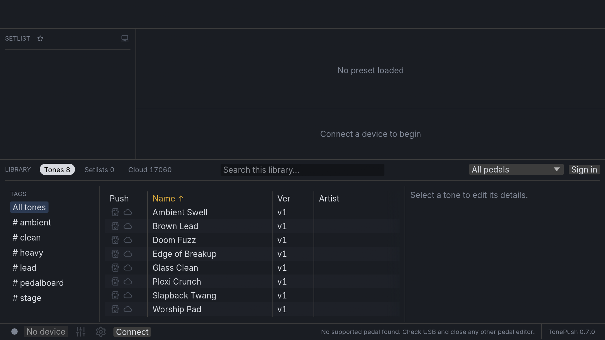

`before-0.7.0-no-device.png`: the installed 0.7.0 release, captured live on a
headless output with a scratch profile holding eight synthetic tones (the
machine's monitor profile pins that output at 960 × 540, so this is the size
the editor opens at, close to its own 980 × 640 default). No pedal is
attached.

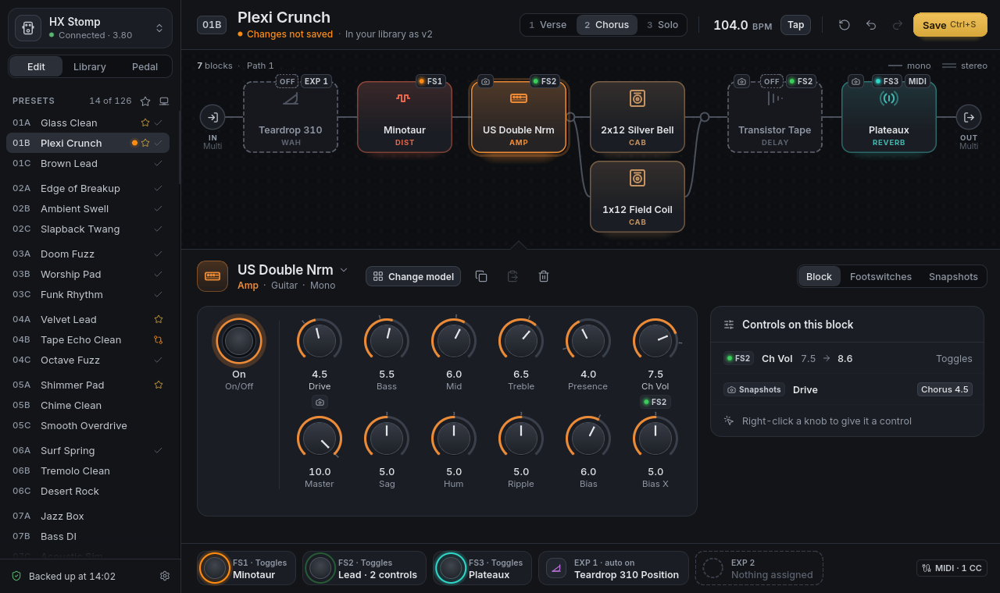

`docs/screenshot.png`: the README's own capture of the connected editor
(0.5.6; the layout is unchanged in 0.7.0). There is no capture of the PRO
editor anywhere, and no hardware here, so its problems below come from reading
`crates/tonepush-gui/src/pro.rs`.

Every capability is there; they compete at the same volume.

1. **Six regions at once.** Preset list, chain, block, model shelf, library
   and status bar are all permanent panels (`processor.rs`: a 46 pt top bar, a
   28 pt status bar, a 216 pt preset panel, a 260 pt library strip, a 430 pt
   shelf). In the README capture the block being edited gets about a third
   of the window, and most of that is its picture; the knobs get one row.
2. **The model browser never leaves.** `shelf()` keeps "SWAP FOR" and a
   thumbnail grid open beside the knobs although swapping a model is the
   occasional job and turning a knob the constant one.
3. **The library is docked under the editor.** Tones, setlists and Cloud, a
   tag rail, an eight-column table and an inspector share a strip that is
   either too short to read or steals the editor's height.
4. **The pedal is a door behind its own name.** Backups, impulse responses,
   favourite blocks, diagnostics, preferences and global EQ are three floating
   `egui::Window`s opened from the device name and two icons in the status bar;
   on the PRO the NAM and IR libraries, backup and settings are one 760 × 560
   window with tabs.
5. **State hides in corners.** With no pedal the top bar is empty, the chain
   says "No preset loaded", the editor says "Connect a device to begin", and
   the reason ("No supported pedal found. Check USB and close any other pedal
   editor.") sits in small dim text at the far right of the status bar.
6. **Amber means everything.** `ACCENT` marks the loaded preset, every value,
   the edited preset's name, the active snapshot, the tempo, icon hover, knob
   arcs and the sorted column; `DIRTY`, a second orange, marks unsaved edits.
   Selection, data and "act now" look the same.
7. **Type is small and doubled.** Inter plus IBM Plex Mono for readings, at
   eight sizes from 8 to 16 pt; chain tiles caption at 9.5 pt and the PRO's
   cards at 8 pt.
8. **Tiles spend their height on artwork.** 96 × 108 tiles elide names at 15
   characters ("2x12 Silver Be…"), and a full HX Stomp chain is wider than a
   1024 window.
9. **Controller assignments are scattered** across corner badges, an "Assign
   control" mode, right-click menus on knobs, an ASSIGNMENTS table under the
   knobs and a wrapped line of footswitch settings. Nothing shows what each
   footswitch does.
10. **Snapshots are three text buttons.** What a snapshot changes is
    invisible, although the preset document carries it
    (`Preset::snapshot_details`).
11. **Writes to flash speak in different voices**: "Remove" next to "Cancel",
    "Write it", "Write to pedal" before "Cancel", all in stock egui windows,
    and a setlist push rewrites all 126 slots whatever they hold.
12. **The PRO's chain is fixed.** Fourteen narrow cards in a hard-coded order
    (`preset_blocks`' `CHAIN`), generic node controls, the rollback guard as
    dim status-bar text ("Automatic backup required for Save") while Save
    silently disables, slot tools as a row of buttons (Rename, Replace…,
    Export…, Export pair…, ↑, ↓, Remove), stereo IR pairs only implied by an
    "Export pair" button, and no firmware update. Firmware 2.x makes the chain
    dynamic, so this design cannot carry it.
13. **First run blocks the window.** An emoji-led modal that cannot be
    dismissed asks for HX Edit's installer whenever the catalog is missing
    (`show_onboarding = catalog.is_none()`), so a StompStation PRO owner, whose
    pedal needs none of it, faces it until the pedal connects.
14. **Three category palettes.** HX tiles use HX Edit's colours from the
    catalog, PRO tiles use `processor::category_accent` (where reverb is blue,
    not orange), and tonepush.rocks uses a third set.

What is good stays: dragging blocks and junctions along the line, adding at
any gap, the dashed offer of a parallel branch, the pedal / computer / cloud
place marks, HX Edit's own value formatting, Shift-drag for fine moves and
double-click to reset, "Toggles" and "Holds", auto-engage worded as what it
does, sending a tone by choosing its slot in the pedal's own list, and every
safety rule around writes.

## Principles

Solco's principles, applied to a pedal.

- **Keep the pedal in reach.** The connected pedal's presets are the sidebar,
  on every page, in the pedal's own banks and labels. Sending a tone, pasting
  a preset or comparing a setlist happens against that list.
- **One job per surface.** Three pages: **Edit** (the loaded preset),
  **Library** (tones, setlists, Cloud) and **Pedal** (the device itself:
  backups, IR and NAM libraries, favourites, global EQ, settings, firmware).
  Each shows only what its job needs; Library and Pedal shrink the loaded
  preset to a one-line deck.
- **Laid out like the hardware.** The chain is the pedal's screen, at the top;
  the selected block's face is in the middle; the floor strip at the bottom is
  what the pedal has under your feet and hands: FS1 to FS5 with their LED
  rings and EXP pedals on an HX, F1 to F4 and the CTRL pedal on the PRO. Slot
  labels, bank letters and LED colours are the pedal's.
- **Show the state before the data.** Connected, protected, edited, backed up
  and on which firmware come first, in words, where the question is asked:
  the device card, the deck's second line, the sidebar's foot.
- **Lenses for occasional jobs, tools for constant ones.** Knobs and the
  footswitch strip are always there. The model browser, the footswitch editor
  and the snapshot matrix open from their own anchors (Change model, a
  footswitch, the snapshot control) and replace the block pane until closed.
  On a large screen the lenses sit side by side instead. (Solco's ADR 0172
  reversed "modes, not permanent tools" for its deck; here the constant tools
  stay permanent and only the occasional ones are lenses.)
- **Say what will happen.** Every write to the pedal's memory names its
  outcome with counts before it happens: "4 presets replaced, 2 slots emptied,
  36 already match and are left alone", "Update to 2.2.6", "Back up to unlock
  saving".
- **Amber means your next action.** The primary button and nothing else.
  Unsaved edits keep their own hot orange; selection is a neutral fill; values
  are text; colour belongs to the block's category.

## The frame

- **Sidebar** (232 pt; 216 below 1100 pt, 272 from 1800 pt), full height, and
  hideable (Ctrl B; the deck then starts with the button that brings it
  back). From the top: the **device card** (pedal drawing, name, connection
  and firmware, and a switcher when more than one pedal is attached); the
  **Edit · Library · Pedal** switch; **Presets**, with the count kept in the
  library, a favourites filter and "keep the whole pedal as a setlist"; the
  preset list, three rows to a bank (four on an HX Effects) with a 6 pt gap
  between banks; and a **foot** with the protection state ("Backed up at
  14:02", "Protected · backup 14:02", "Not protected yet") and settings.
- **Deck**, 64 pt (56 and 72 at the other sizes): slot chip, preset name,
  and under it the state line ("3 changes not saved · In your library as
  v2"). Then snapshots (HX), tempo with Tap, undo, redo and Save. On Library
  and Pedal pages it is a 52 pt bar with a mini chain and Edit.
- **Board**: the chain on the darker dotted surface, with a header row
  ("7 of 8 blocks · Path 1", or the PRO's slots) and the mono and stereo
  legend.
- **Pane**: the selected block, or a lens.
- **Floor**: the pedal's own controls, 64 pt.
- No status bar. The version and update offer move to settings and the
  sidebar foot; activity moves to the deck's state line; diagnostics become
  the Pedal page's Activity tab.

Three tiers, chosen by window width: S up to 1100 pt (compact tiles without
captions, knobs 44 to 52, shorter labels), M (the reference, 1280 × 760), L
from 1800 pt (larger tiles and knobs, and every lens on screen at once).

## Visual system

Every value is a named token in `theme`, read from the current palette each
frame. `source/assets/app.css` is the specification; the tables below are its
summary.

### Type

One face: Inter 4.001 as bundled by fastframe-fonts, with tabular figures
frozen into its character map, so every reading keeps its width while a knob
turns. IBM Plex Mono goes, as it went from Solco, ZapFast and Spotifast: it
existed to stop values shuffling sideways, which the frozen figures now do,
and a second face at a second set of sizes was half of the visual noise. The
monospace family maps to the same Inter, kept as a name for raw paths and the
protocol log.

Weights 400, 500, 600 and 700 (`fastframe_fonts::Weight`). egui draws every
size at Inter's default optical size, so the mockups set
`font-optical-sizing: none`.

| Size | Weight | Use |
| --- | --- | --- |
| 9.5 | 700, caps, +0.08 em | tile category caption, endpoint labels |
| 10 to 11 | 600 to 700 | tags, chips, section captions (11, caps, +0.07 em) |
| 11.5 | 400 to 500 | knob labels, slot labels, meta |
| 12 to 12.5 | 400 | secondary text, table meta, tile names (12.5/600) |
| 13 | 400 | body, rows, buttons (600) |
| 14 to 15 | 600 | card and sheet titles, switch names |
| 17 | 600 | block name in the pane |
| 20 (22 at L) | 600 | preset name in the deck |
| 22 | 600 | page titles |
| 30 | 700 | the welcome screen, the only display size |

### Spacing and shape

A 4 pt grid: 4, 8, 12, 16, 20, 24. Panes pad 20 pt left and 16 pt right.
Radii: chips 5, controls 8, menus 10, tiles 12, cards 14, dialogs 16. One
shadow, for floating layers only (menus, dialogs, the selected tile's glow).

### Colour, dark

Surfaces, lines, text and accent are tonepush.rocks' tokens, which are
theme.rs' own values extended by two steps.

| Token | Value | Use |
| --- | --- | --- |
| `bg-deep` | `#0d0f12` | the board, field wells |
| `bg` | `#121418` | window, sidebar, pages |
| `panel` | `#1a1d23` | cards, tiles, faceplates |
| `raised` | `#22262e` | controls at rest |
| `hover` | `#2a2f38` | hover, selected rows, active segment |
| `pressed` | `#333945` | pressed |
| `tile-off` | `#16181d` | a bypassed tile |
| `line-soft` / `line` / `line-strong` | `#1f2329` / `#2a2e36` / `#3a404b` | hairlines, edges, control outlines |
| `wire` | `#4a505c` | the signal |
| `text` / `text-soft` / `muted` / `faint` | `#e4e6ea` / `#c3c8d0` / `#8f97a4` / `#5b626e` | four levels of text |
| `accent` | `#d8a83b`, bright `#f0c25a`, ink `#1a1405` | primary action, focus |
| `hot` | `#ff8c10` | edited and not saved, differences |
| `ok` | `#58b46e` | connected, protected, verified |
| `danger` | `#e8664a` | destructive actions, failures |
| `info` | `#5f9be0` | neutral notes |

### Colour, light

The website has no light theme; the Editor does.

| Token | Value |
| --- | --- |
| `bg-deep` / `bg` / `panel` | `#e7e8e5` / `#f5f5f3` / `#ffffff` |
| `raised` / `hover` / `pressed` | `#efefec` / `#e7e7e3` / `#dcdcd7` |
| `line-soft` / `line` / `line-strong` / `wire` | `#ebebe8` / `#dfdfda` / `#c4c5c0` / `#9ea3ab` |
| `text` / `text-soft` / `muted` / `faint` | `#1a1c1f` / `#3b3f46` / `#69707a` / `#a2a7af` |
| `accent` | `#a87612` for text and icons; the primary button keeps the amber gradient and dark ink |
| `hot` / `ok` / `danger` / `info` | `#dd6a00` / `#2d8a47` / `#c8492d` / `#3570b8` |

### Category colours

One palette for HX tones, PRO tones and the website: tonepush.rocks'
`CATEGORY_ACCENTS`. It replaces both HX Edit's colours (read from the catalog
today) and `processor::category_accent`. The light column is the same hue
darkened to read on white.

| Category | Dark | Light | HX Edit, for reference |
| --- | --- | --- | --- |
| Distortion | `#e8664a` | `#cf4b30` | `#f5901e` |
| Dynamics | `#d9b13b` | `#a98510` | `#ddcc00` |
| EQ | `#a9bb4f` | `#788c22` | `#ddcc00` |
| Modulation | `#5f9be0` | `#3a76c2` | `#0094e9` |
| Delay | `#58b46e` | `#2e8a49` | `#00cc00` |
| Reverb | `#3fb8b2` | `#1b8c87` | `#ff5c00` |
| Pitch/Synth | `#9d80e3` | `#7558cc` | `#ad46e2` |
| Filter | `#d27bc0` | `#b0509b` | `#ad46e2` |
| Wah | `#b96fd8` | `#964cc0` | `#a844db` |
| Amp, Amp+Cab | `#ec8a35` | `#cf6c12` | `#dd1111` |
| Preamp | `#f2ad55` | `#c68420` | `#dd1111` |
| Cab | `#c69462` | `#976a3c` | `#dd1111` |
| IR | `#e07892` | `#c24b6b` | `#f23091` |
| Volume/Pan | `#93a3b6` | `#64758a` | `#38a696` |
| Send/Return | `#7fb2a2` | `#4a8676` | `#38a696` |
| Looper, I/O | `#a69e98`, `#8b93a1` | `#837b75`, `#7c828a` | `#989898` |

Why one palette: HX Edit's set gives amp, preamp and cab one red, dynamics and
EQ one yellow, and pitch, filter and wah one purple; the PRO has no catalog to
read colours from; and a tone should look the same in the editor and on
tonepush.rocks. What HX Edit's colours carried, the light under your foot,
stays exact: footswitch LEDs are always drawn in the colour the pedal lights
(White, Red, Dark Orange, Light Orange, Yellow, Green, Turquoise, Blue,
Violet, Pink, Off), never in a category colour. This reverses theme.rs'
"the colours are HX Edit's" and is the first open question below.

### Components

**Block tile** (`.tile`). Width fills the board between a minimum and a
maximum (HX: 72 to 104 pt at S, 92 to 124 at M, 136 to 176 at L; PRO: 64 to
88, 68 to 112, 96 to 150), height 84, 92 or 128. Radius 12. Fill `panel` under
a vertical wash of the category colour at 15 %, fading out at 72 %. Rest:
1.5 pt border in the category colour at 48 %. Selected: full-strength border,
a 3 pt outer ring at 24 %, a stronger wash, and a 22 × 11 pt notch cut into
the board's bottom edge under its centre, pointing at the pane. Bypassed:
1.5 pt dashed `faint` border on `tile-off`, grey drawing and name, and an OFF
tag. Content is centred: the category drawing (24 pt; 20 compact, 30 large)
in the category colour, the name in 12.5/600 on at most two lines, never
broken inside a word, then the category caption (HX) or the model line
(PRO, 11/400 `muted`). **Tags hang on the top edge**, half outside the tile
like tape on a pedal, so they never cover the drawing or the name: 18 pt,
radius 5, `panel` fill, `line-strong` border, 10/700. Left: the snapshot mark
(a camera, when snapshots set something on the block) or the PRO's lock for
a fixed block. Right: what drives it (FS1 with the switch's LED colour, EXP 1,
F1 to F4, CTRL) or OFF. Compact tiles show a footswitch tag as its LED dot.

**Knob** (`TP.knobSvg`). Diameter K, chosen per pane as the largest of 76, 68,
60, 52 or 44 pt whose balanced rows fit the room; the cell is K + 26 pt wide.
A 270° track from 135°, 3 pt in `line-strong`; the value arc over it, 3 pt
with round caps, in the block's category colour; a 1.4 pt `faint` tick just
outside the track at the default value (the double-click target). The face is
a circle of radius K/2 − 10 with a two-stop vertical gradient (dark `#363b45`
to `#1d2026`, light `#ffffff` to `#e6e6e2`), a 1 pt edge and a 1.5 pt drop
shadow; the pointer is 2.2 pt in `text`, from 22 % to 80 % of the face. Under
it: the value in 13/500 tabular figures, the name in 11.5 `muted`, and an
18 pt row for its tags (camera, FS2, EXP 1, F1, CC 12).

**Faceplate** (`TP.face`). The block's controls on a `panel` card. The on/off
switch owns the first column across every row; a 1 pt divider follows; the
rest wrap into balanced rows (never one straggler), so columns line up.
Paired models (Amp+Cab) are two groups on one face; a NAM capture is a cell
three knobs wide.

**Footswitch** (`TP.switchSvg`, `.fsw`, `.swrow`). The block's on/off is drawn
as the switch your foot presses: the pedal's LED ring at radius K/2 − 3,
2.6 pt in the LED colour with a 7 pt glow at 22 % when on, 1.6 pt dashed
`faint` when off; a stomp button inside with a radial gradient. On the floor
strip each switch is a 44 pt chip: the ring, "FS1 · Toggles", and what it
carries. In the Footswitches lens each switch is a 52 pt row: ring, name,
every control it carries as chips, and Toggles or Holds.

**Lanes, wires and junctions** (`TP.renderChain`). The main line runs through
the tiles' centres. Mono signal is one 2 pt `wire` line; stereo is two 1.5 pt
lines 3.6 pt apart, following the models (a stereo model's output is stereo,
a mono model collapses it, a merge with panned lanes is stereo). A fork or
merge takes a junction width (HX 26, 30, 34; PRO 20, 22, 30): a 4.5 pt ring
dot on the line and cubic curves that leave and arrive horizontally. Lanes
stack at tile height plus 10 pt (14 at L). Split types other than Y wear a
9.5/700 tag under the fork (A/B, XO, DYN). Gaps offer an 18 pt amber "+" under
the pointer. A PRO free slot is a dashed rounded rectangle 16 to 24 pt wide at
60 % of tile height with a "+".

**Board.** `bg-deep` with 1 pt dots on a 16 pt grid at 4.5 % white (6 % black
in light), a 20 pt header row, the chain centred when it is narrower than the
window and fading out at the right edge when it is wider.

**List rows.** Sidebar preset: 26 pt, radius 7, slot label in 11.5/500 tabular
in a 27 pt column, name in 13; marks at the right: the edited dot (`hot`,
7 pt with a 3 pt halo), favourite star, a check when the library has it
unchanged, a compare mark in `hot` when it differs. Selected: `hover` fill and
`text`; hovered: `raised`. In send mode free slots read "Empty" in `accent`
and the drop target gets a dashed accent outline and "Put it here". Table
rows: 36 pt (34 in device tables) with `line-soft` separators under a 32 pt
header. Switch rows 52 pt; setlist rows 64 pt; bank cells 30 pt.

**Controls.** Buttons 30 pt (26 small, 36 large), radius 8, 13/600. Primary:
the amber gradient `#f0c25a` to `#d8a83b` with `#1a1405` ink, a 1 pt inner
highlight and a soft amber glow, like the lit footswitch in the app icon.
Secondary: `raised` with a `line-strong` border. Ghost: text only. Danger:
filled `danger`. Segmented controls 30 pt with 24 pt segments; chips 20 pt.

**Menus** follow Solco's menu idiom (`docs/design/menus-2026-09-26` in
Solco): 28 pt rows with an icon slot and a right-aligned hint, a header naming
the target, separators, destructive items last in `danger`.

**Dialogs.** Radius 16; title 18/600; one line of explanation; outcome rows
(icon, count in 14/600 tabular figures, sentence) in a framed list; a footer
with a note on the left and the actions on the right, the confirming action
last and named by its outcome. Destructive confirmations use the filled danger
button and still list exactly what they remove.

**Banners and steps.** 14 pt cards with a 36 pt tinted icon well (ok, hot,
danger, info). Progress bars 6 pt (8 for firmware). Steppers with 22 pt
circles: done is a check on `ok`, now is filled amber, failed is an x on
`danger`.

## The screens

### 01 · HX Stomp editor

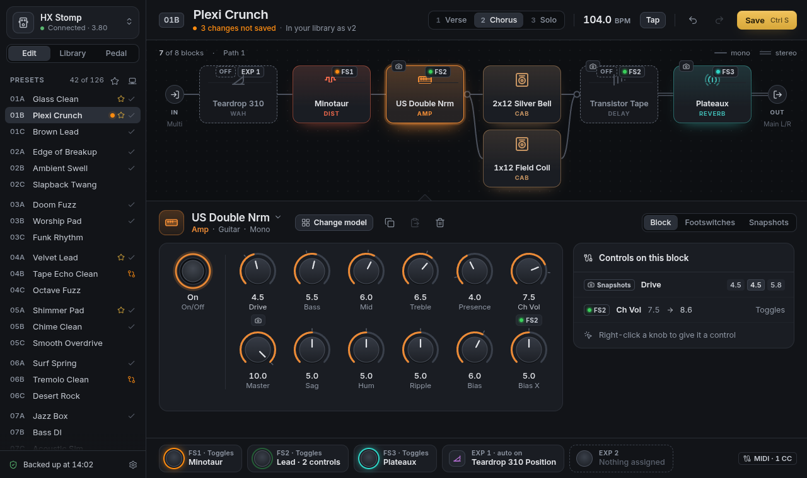

Also [2560 × 1440](01-hx-editor-2560x1440.png) and
[1024 × 640](01-hx-editor-1024x640.png).

01B Plexi Crunch on an HX Stomp: a wah under EXP 1 (off at the heel), the
Minotaur on FS1, the US Double Nrm selected, a Y split into two cabs merged
in stereo, a tape delay that only the Solo snapshot turns on, and Plateaux on
FS3. Changed:

- The preset list is the sidebar, with library marks instead of an icon on
  every row, and the edited dot where the eye is.
- The deck says the state in words ("3 changes not saved · In your library as
  v2") beside snapshots, tempo, undo, redo and Save, which turns amber only
  when there is something to save.
- Tiles are smaller and say more: category drawing and colour, full name on
  two lines, caption, and hanging tags for what drives them. Off is dashed.
  Wires show where the sound becomes stereo.
- The pane is the block: its name doubles as the model switch, Copy, Paste and
  Remove sit beside it, and twelve knobs fill two rows of 60 pt knobs with the
  on/off switch in its own column. "Controls on this block" replaces the
  ASSIGNMENTS table: Drive follows snapshots (4.5, 4.5, 5.8) and FS2 raises
  Ch Vol from 7.5 to 8.6.
- The floor shows the HX Stomp's switches with their LED rings, EXP 1 and
  EXP 2, and the MIDI CC count.
- At 2560 × 1440 every lens is on screen: the block, the Footswitches board,
  the controls card, the snapshot matrix and the tone's library facts. At
  1024 × 640 tiles drop their captions and the snapshot control shows only the
  active name.

### 02 · Model browser

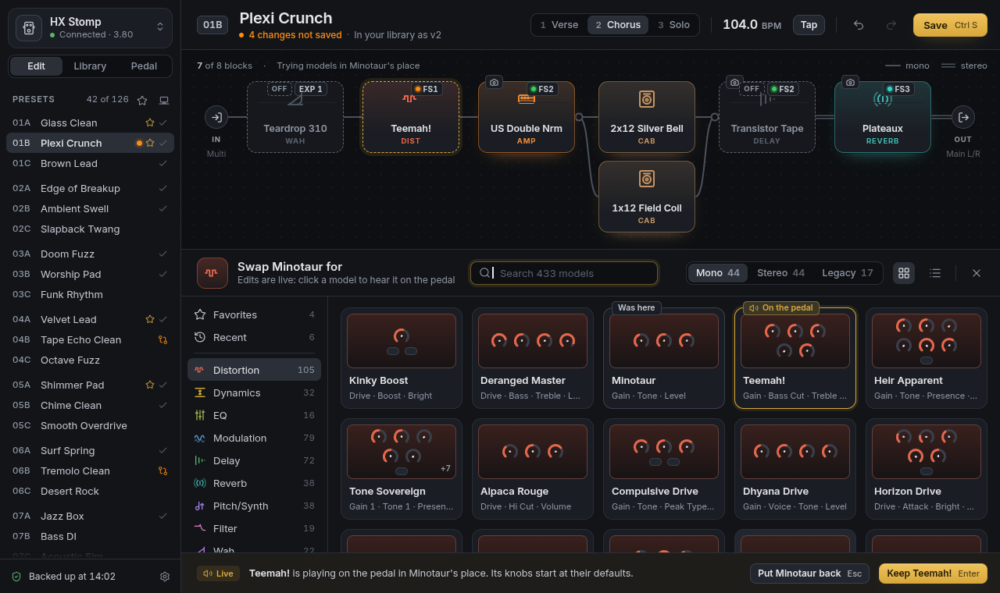

"Change model" (or a "+" in a gap) opens the browser in the pane; the chain
stays in view with the target slot outlined in dashed amber. Search is
focused. The rail lists Favorites (the pedal's), Recent, then HX Edit's
categories with their counts; the shelf switch keeps Mono, Stereo and Legacy.
Each card's face is drawn from the model's real controls, its knobs at their
defaults, with the control names under the name (HX Edit's picture replaces
the face where installed). Because the edit buffer is live, a click plays the
model on the pedal at once; the bar at the bottom says so and offers "Put
Minotaur back" (Esc) and "Keep Teemah!" (Enter). Today's shelf already swaps
on click; this makes the audition explicit and reversible.

### 03 · Footswitches and controllers

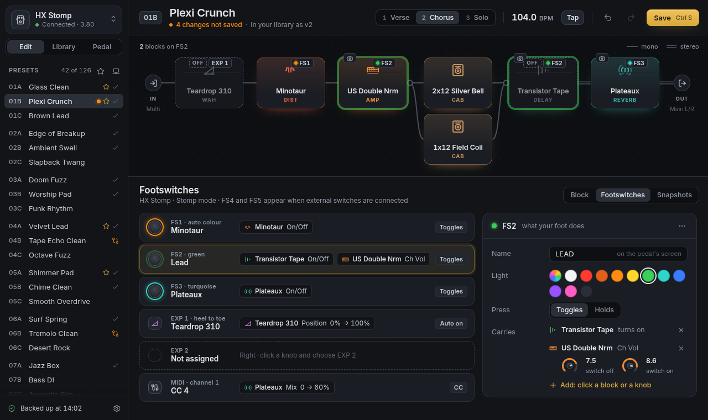

Opened from a floor chip or the lens switch. Every source is one row: FS1 to
FS3 (FS4 and FS5 appear with external switches), EXP 1 and 2, MIDI CC; each
shows its LED ring and every control it carries. The selected switch's
editor is beside it: the name its scribble strip shows, the LED colour as the
pedal's eleven colours plus Auto, Toggles or Holds, and each carried control
with its two ends drawn as that parameter's own knobs, as the current
assignments table does. The blocks FS2 reaches light up in the chain. The
floor hides while the lens is open, because the lens is the floor in full.

### 04 · Snapshots

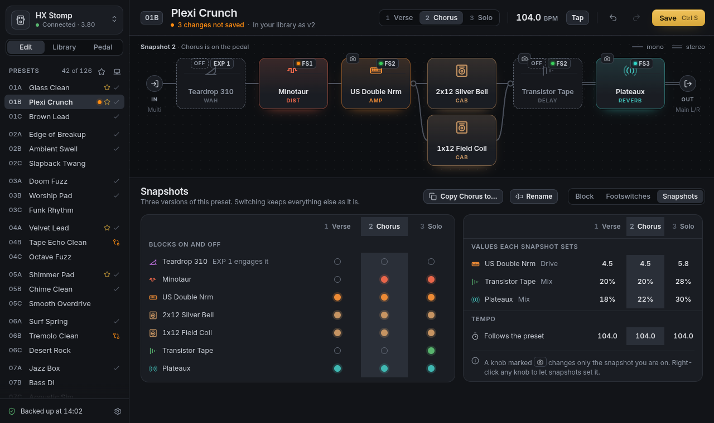

A matrix of what each snapshot changes: which blocks are on in Verse, Chorus
and Solo, and the values each sets, with the snapshot on the pedal
highlighted. The block rows come from `Preset::snapshot_details` today; the
value rows need the snapshot controller values decoded (stage 4). Copy and
Rename act on the selected snapshot.

### 05 and 06 · Presets and setlists

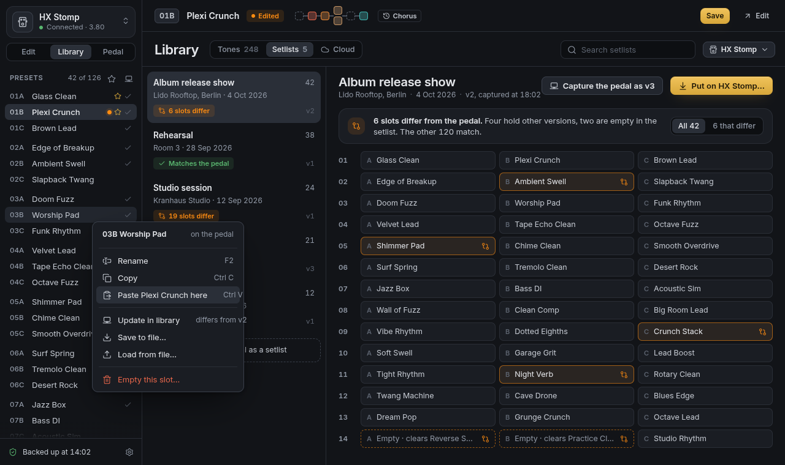

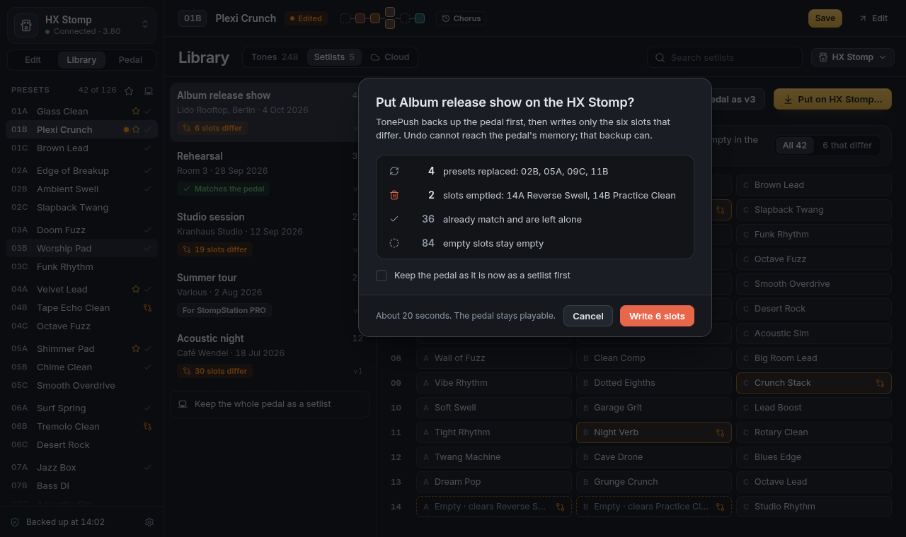

Library › Setlists. Each setlist says first whether it matches the pedal
("Matches the pedal", "6 slots differ", "For StompStation PRO"). The selected
one is shown bank by bank, A B C, against what is on the pedal now: replaced
slots in `hot`, slots the setlist would empty dashed and named. The
preset's own menu in the sidebar (rename, copy, paste, update in library,
save to and load from a file, empty the slot) follows the menu idiom. Putting
a setlist on the pedal (06) backs up first and writes **only the slots that
differ**; the dialog counts them: 4 replaced, 2 emptied, 36 left alone, 84
empty that stay empty. Today every slot is rewritten; this is a behaviour
change, listed in the open questions.

### 07 · Library, sending a tone

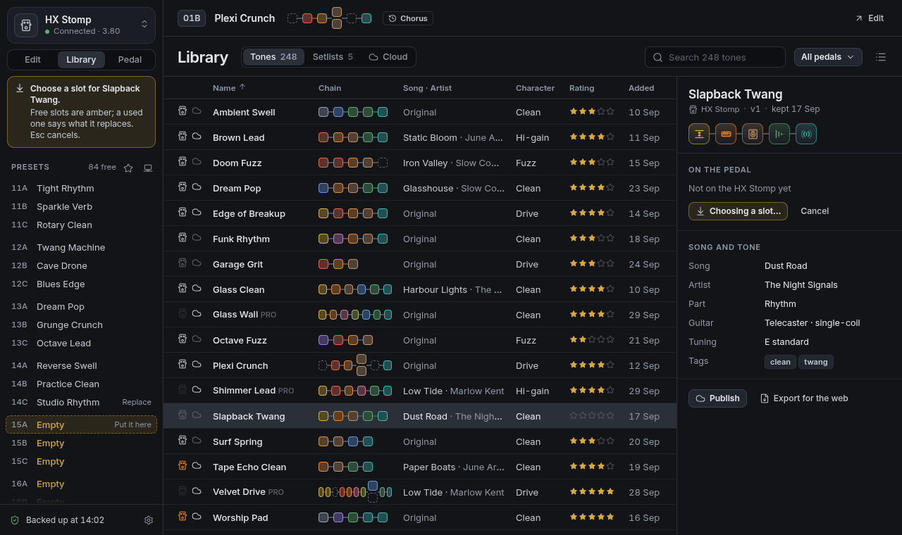

Library › Tones: one row per tone with its place marks (on the pedal, on
TonePush), its chain as a strip of category colours, song, character, rating
and when it was kept; PRO tones say so. The inspector holds the tone's chain,
where it is, its song and tone details, and Publish and Export. "Send to a
slot" turns the sidebar into the destination, exactly as sending works today,
now with free slots in amber and the target's consequence in the row
("Replace", "Put it here").

### 08 · HX backups

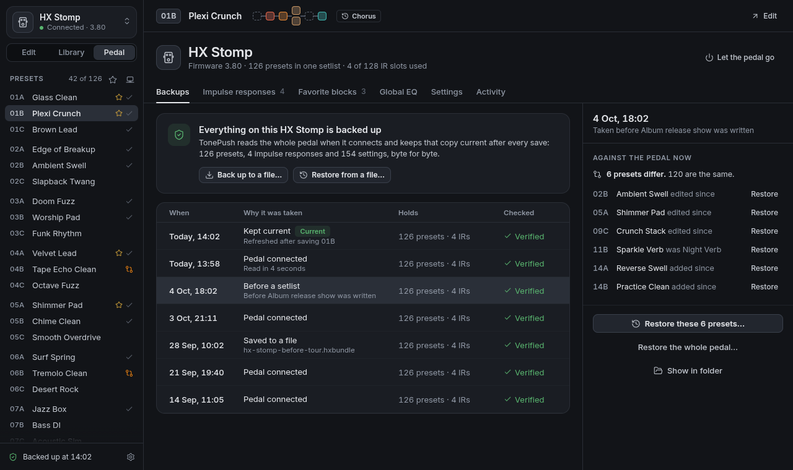

Pedal › Backups. The banner says the pedal is backed up and how (read whole on
every connect, kept current after every save). The history lists every
automatic and manual backup with why it was taken, including "Before Album
release show was written", each verified. Selecting one compares it with the
pedal: 6 presets differ, each restorable alone, or all six, or the whole
pedal. Restoring single presets from a backup is new.

### 09 · StompStation PRO editor, firmware 2.x

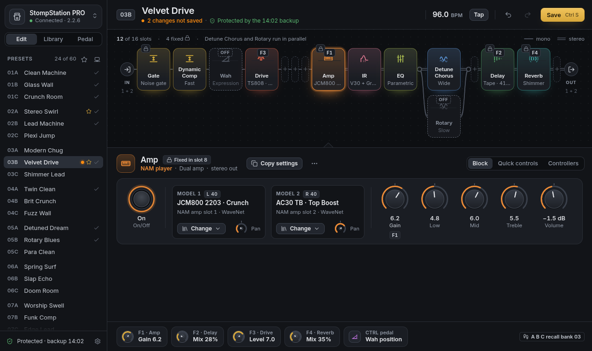

Also [2560 × 1440](09-pro-editor-2560x1440.png) and
[1024 × 640](09-pro-editor-1024x640.png), with the sidebar hidden so all
sixteen slots fit.

03B Velvet Drive. The same frame and components as the HX, so the families
read as one editor:

- The chain is the pedal's sixteen positions, left to right: blocks, free
  slots as dashed "+" slots, and the four fixed blocks (Gate, Amp, Delay,
  Reverb) with a lock tag. A parallel connection between two adjacent blocks
  stacks them as two lanes with a fork and a sum, like an HX branch. The wire
  is mono through the Drive NAM and stereo from the dual amp on.
- The selected Amp shows both NAM captures (model 1 panned left, model 2
  right) as wide cells with their slot and a Change button, then Gain, Low,
  Mid, Treble and Volume.
- The deck's state line carries the PRO's guard: "Protected by the 14:02
  backup".
- The floor is the PRO's own: the F1 to F4 quick-control knobs of this preset
  with what each turns, the CTRL pedal, and the A B C bank.
- At 2560 × 1440 the Quick controls, the three Controllers with their linked
  parameters, the protection card and the library card join the block.

### 10 and 11 · NAM and IR libraries

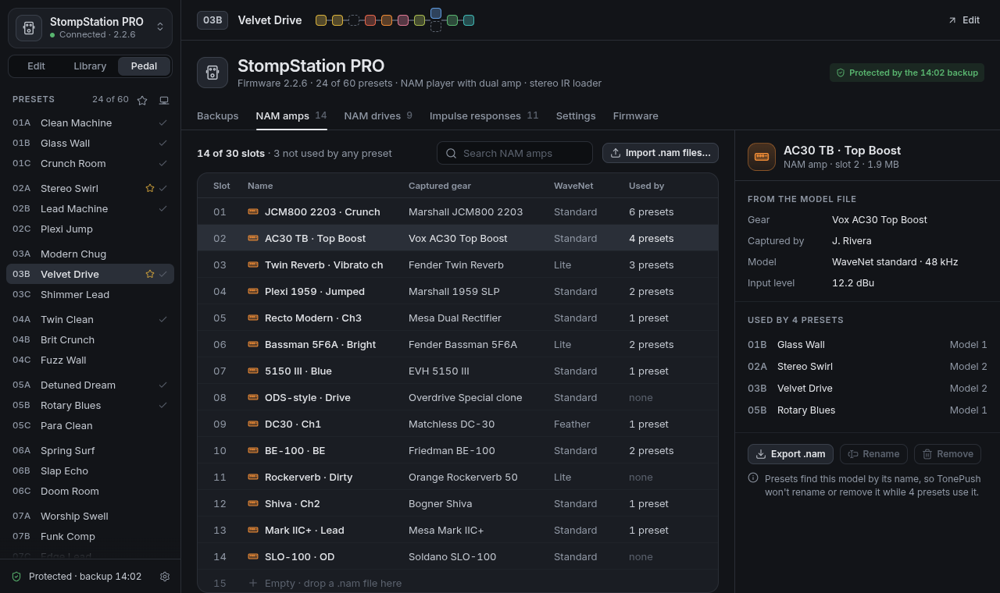

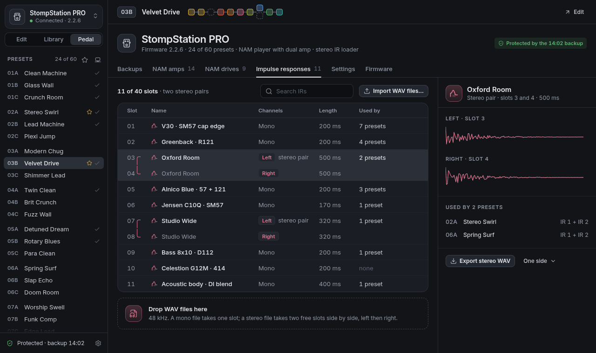

Pedal › NAM amps, NAM drives, Impulse responses. One table per library with
the slot, the name, what the model file says about itself (gear, WaveNet
size) and how many presets use it. The inspector shows the file's metadata,
every preset that uses it and, because presets find models by name, why Rename
and Remove are unavailable while they do (TonePush's existing rule, now
visible). Stereo IR pairs are bracketed across their two slots and shown as
one item with both channels' waveforms; dropping a WAV says where it will go.
Slot capacities here are illustrative: the editor shows what the pedal
reports.

### 12 to 17 · Firmware update, PRO

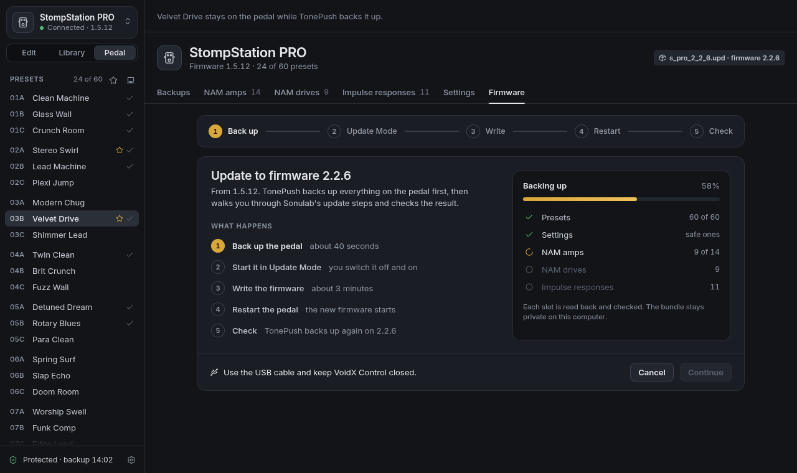
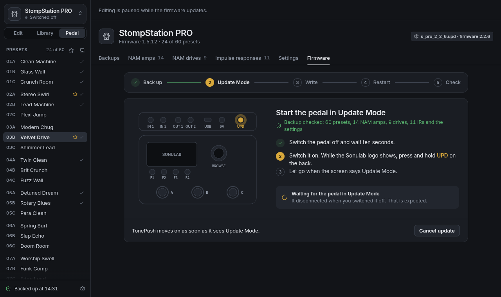
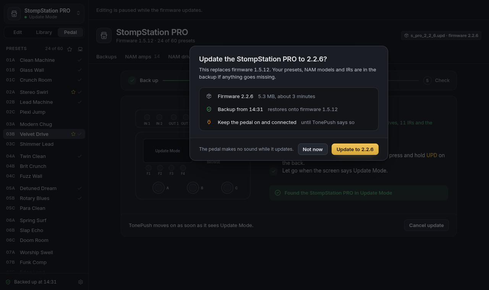
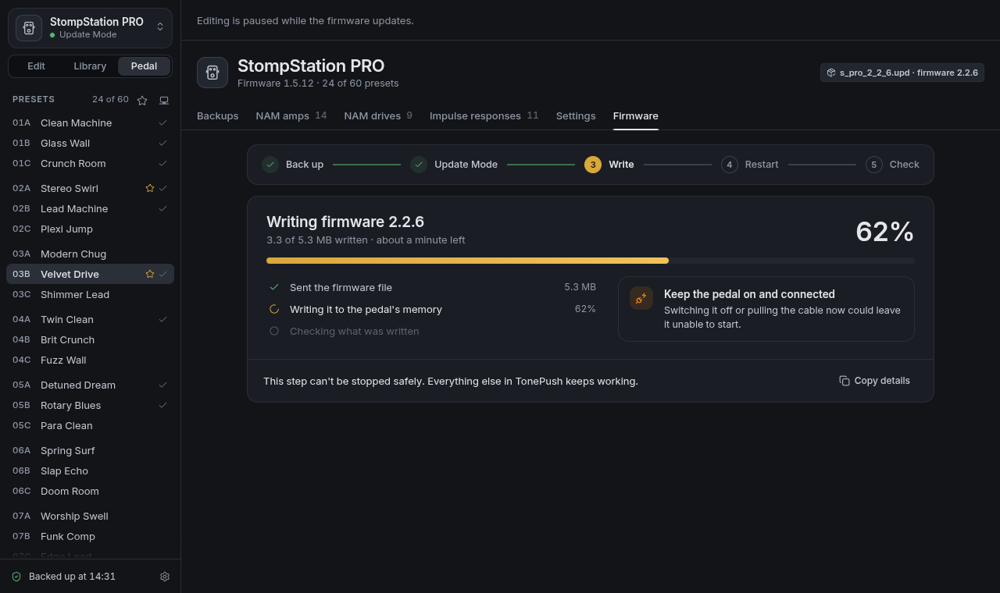
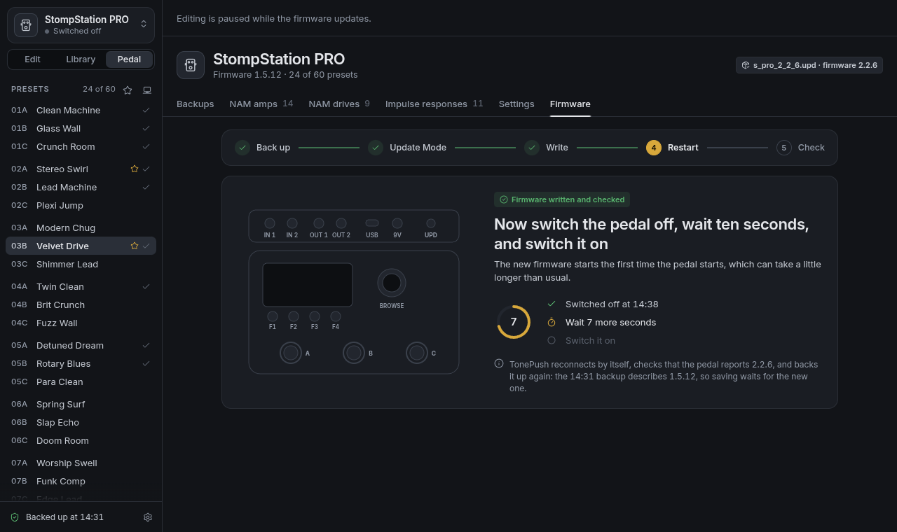
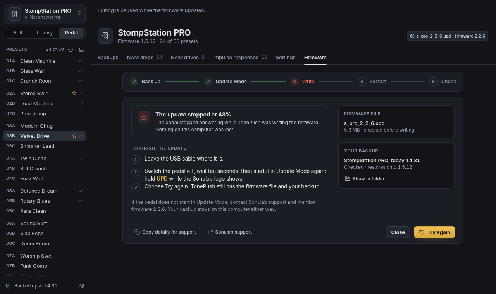

Pedal › Firmware, after choosing Sonulab's `.upd` file. Five steps, always in
view: Back up, Update Mode, Write, Restart, Check. They follow Sonulab's own
procedure (switch off, wait ten seconds, switch on and hold UPD at the logo;
after writing, switch off, wait ten seconds, switch on).

1. **Back up** (12) is not optional: presets, settings, NAM amps and drives
   and IRs, each read back and checked, with Continue disabled until it is.
2. **Update Mode** (13) shows where UPD is on a drawing of the pedal and
   waits; the pedal disappearing when switched off is announced as expected.
   TonePush moves on by itself when it sees Update Mode.
3. **Confirm** (14) names the version, size and time, the backup and what it
   restores onto, and the one rule: keep it on and connected.
4. **Write** (15): percentage, megabytes and time left, the stage, and why it
   cannot be stopped. The rest of TonePush keeps working.
5. **Restart** (16): "Now switch the pedal off, wait ten seconds, and switch
   it on", with the switch-off detected, a countdown and the switch-on
   pending. Afterwards TonePush checks the reported version and backs the
   pedal up again, because the old backup describes the old firmware and the
   guard keys on firmware.
6. **Failed** (17): where it stopped, that nothing on the computer was lost,
   the three steps to finish (cable stays, restart into Update Mode, Try
   again), what to do if the pedal will not start in Update Mode, and the
   firmware file and backup it still holds. Copy details for support.

TonePush does not update firmware today and VoidX Control does it; building
this needs the Update Mode transfer captured or documented. Until then the
same screens can stop at step 2 and hand over to VoidX Control.

### 18 · Connect, and first run

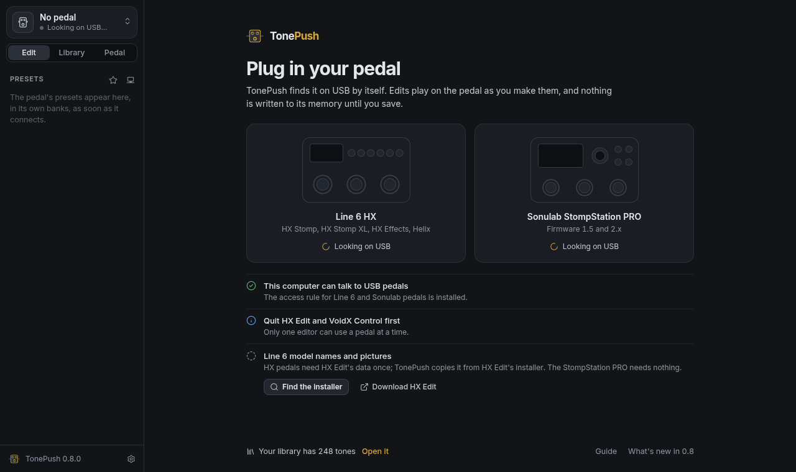

Also [1024 × 640](18-connect-1024x640.png).

With no pedal the window is one calm page instead of three empty panels: the
TonePush mark, "Plug in your pedal", both families with what they cover and a
live "Looking on USB", what is already fine (the USB access rule), what to do
(quit HX Edit or VoidX Control), and Line 6's model data as a step you can
take, not a wall: "Find the installer" and "Download HX Edit", with a plain
note that the StompStation PRO needs nothing. The library stays one click
away.

### 19, 20 · Light theme

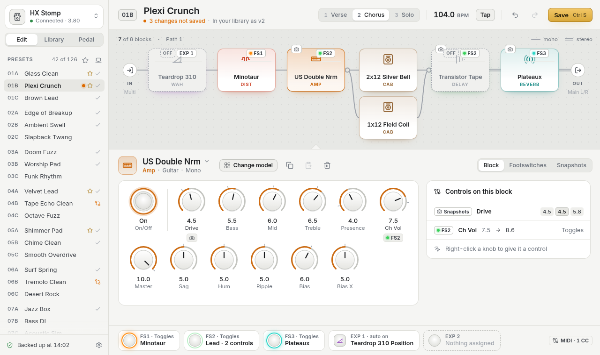

Also [2560 × 1440](19-hx-editor-light-2560x1440.png) and the
[PRO editor](20-pro-editor-light-1280x760.png). Same layout, the light tokens,
white knob faces, the board one step darker than the page.

### 21 · PRO, not protected yet

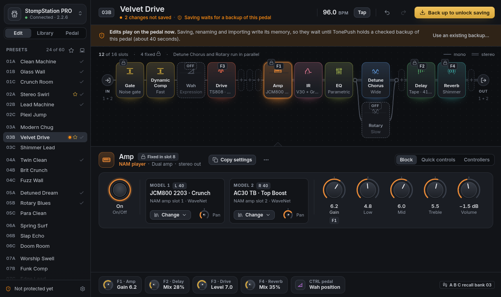

The rollback guard said in place: edits play live; Save, rename and import
wait for a checked backup of this pedal, and the one action that unlocks them
takes Save's place ("Back up to unlock saving", about 40 seconds), with "Use
an existing backup…" beside the explanation.

## The StompStation PRO on 2.x

From the 2.0 user manual and the 2.2.6 firmware's own strings:

- **A dynamic chain of 16 positions.** Gate (position 0), Amp (7), Delay 1
  (13) and Reverb (14) are fixed; the others can be added, moved and removed;
  empty positions are where a block can go. The board draws all sixteen, so
  "where can I add something" has an answer without a menu.
- **Parallel.** Two adjacent blocks can be connected in parallel instead of in
  series; the signal splits, both process, and they are summed. The board
  draws them as lanes, and the connection is chosen on the wire between them.
- **Stereo.** Two inputs and outputs, a mono input duplicated to both
  channels; Drive (NAM) and the gate are mono, everything else stereo. The
  wire shows where the image becomes stereo.
- **NAM.** A Drive block and an Amp block whose player can run two models
  (Model 1 and Model 2, each panned): three NAM models in one preset. The pane
  shows both captures.
- **Blocks beyond the twelve TonePush knows on 1.5.12**: Dynamic Comp,
  Detune Chorus, Rotary, Parametric EQ (four bands), Pitch Time, a second
  graphic EQ and delay, Vintage Flanger and Chorus, Pickup Sim, an FX loop, and
  reverb and delay modes such as Shimmer, Reverse Mix and PCM42. They are
  ordinary tiles; names and controls come from the pedal's schema, as today.
- **Controls.** Per preset, F1 to F4 quick controls on the home screen;
  controllers that move up to three parameters each from a CC, a learned CC or
  the CTRL pedal (2.0 documents two per preset and one global; 2.2.6 lists
  three of each). They replace the `ctl1` and `ctl2` fields today's editor
  hides.
- **Slots read like the pedal**: 01A to 20C, three to a bank, as its home
  screen shows them. The CLI keeps its 1-based numbers.

## Alignment with tonepush.rocks

The website's tokens are a proposal too; this design follows them where they
fit an editor and differs on purpose where they do not.

- **Adopted:** surfaces, lines, wire, the four text levels, accent, hot, ok and
  danger; the amber gradient primary button and the raised secondary button;
  the category palette; the tile's 1.5 pt category border with a 16 % wash
  fading down, dashed border and OFF tag when bypassed; 12 pt tile radius and
  14 pt cards; round IN and OUT marks; the dotted chain board; the wordmark
  "Tone" plus amber "Push" with the app icon.
- **Different:**
  - Inter only, with tabular figures, no Plex Mono, matching Solco and the
    sibling apps (reasons above).
  - No `cv11` or `ss01`: egui cannot select OpenType features and
    fastframe-fonts freezes only `tnum`. Freezing them too would align the
    two, and would change every fastframe app.
  - Titles at 600 and 700, not 720 to 800: the editor's titles are 17 to 22
    pt, and fastframe offers 400 to 700.
  - No animated amber pulse on the wires: it would keep egui repainting every
    frame, the cost the editor's own spinner avoids.
  - OUT is not ringed in amber, because amber means an action here.
  - Controls are 8 pt radius, not 9 to 10, because they are 26 to 30 pt tall.
  - A light theme, which the web lacks.
  - The editor's tile border rests at 48 % so the selected tile, at 100 % with
    a ring, stands out.

## Building it in egui

Everything is flat fills, 1 to 2.6 pt strokes, rounded rects, text, the
existing SVG loader and cubic Béziers, which `theme.rs` already uses. Notes:

- Two-stop gradients (tile washes, knob faces, the primary button) are a
  four-vertex `Mesh` with per-vertex colours; the radial footswitch face is a
  small fan. Dashed rounded borders flatten the rounded rect and use
  `Shape::dashed_line`.
- Hanging tags paint after their tile, outside its rect; tiles allocate
  their full rect and the board reserves 10 pt above the first lane.
- The knob size is chosen from the pane's available rect each frame; balanced
  rows are integer arithmetic.
- Fonts: `FontSetup::default().weights(&[Medium, SemiBold, Bold])`, and drop
  `Monospace::Font` for Plex.
- The board's dots can be painted once into a cached texture and tiled.
- Lens and page state belong in the existing `App` and `pro::Panel`; the
  egui windows (`device_window`, `preferences_window`, `eq_window`, the PRO
  `device_window`) become pages, and the confirmation windows one dialog
  helper in `theme`.

## Implementation order

Each stage leaves the editor working.

1. **Tokens and type.** Every colour a named token for dark and light in
   `theme`; the shared category palette for HX and PRO; Inter only at four
   weights; the component helpers (button, segmented control, chip, tag,
   dialog, banner, menu rows).
2. **Frame.** Sidebar with device card, page switch, preset list and foot;
   deck with the state line; floor strip; status bar retired; device,
   preferences and EQ windows moved into a Pedal page with tabs.
3. **Board.** The new tile with hanging tags, mono and stereo wires,
   junctions, responsive widths; the PRO 2.x chain (sixteen positions, fixed
   blocks, free slots, parallel lanes) once the protocol layer reads it.
4. **Pane.** Fitted faceplate with the switch column; the controls card;
   Footswitches and Snapshots lenses from the existing assignment, switch and
   snapshot data; snapshot values once decoded; the large-screen layout.
5. **Model browser** as a sheet with the audition bar.
6. **Library page.** Tones table and inspector; Setlists with the bank
   comparison; send mode in the sidebar; setlist writes limited to differing
   slots.
7. **Pedal pages.** Backups with history, comparison and single-preset
   restore; NAM and IR libraries with "used by" and stereo pairs; settings;
   global EQ.
8. **Connect and first run**, with HX Edit's data as a step.
9. **PRO firmware 2.x** in `voidx-client`, then the firmware update flow once
   Update Mode's transfer is known.
10. **Light theme** in settings.

## Open questions

- **Category palette.** The web's (proposed) or HX Edit's (today's HX
  editor)? The design works with either; the table lists both.
- **Model pictures in the chain.** This proposal puts HX Edit's pictures in
  the block header and the browser and keeps tiles to drawing, name and
  category, so HX and PRO tiles match and names fit. Keep pictures on tiles
  too?
- **Setlist writes.** Write only the slots that differ (proposed) instead of
  all 126?
- **Restoring single presets** from a backup (proposed in 08).
- **PRO slot labels** as 01A to 20C (proposed) or 1 to 60 (today)?
- **Firmware update** inside TonePush needs Update Mode's transfer protocol;
  until then, hand over to VoidX Control after step 2?

## Rendering

`source/render.mjs` renders every scene with `playwright-core` and the system
Chromium (`/usr/bin/chromium`) at device scale 1, at the sizes in the file
names, with ANGLE on EGL so the capture runs on the GPU. The run reported
`ANGLE (NVIDIA Corporation, NVIDIA GeForce RTX 3090/PCIe/SSE2, OpenGL ES
3.2)`. It ran under `gpu-lock`:

```sh
NODE_PATH=/path/to/node_modules gpu-lock node source/render.mjs        # every scene
NODE_PATH=/path/to/node_modules gpu-lock node source/render.mjs 01 09  # some
```

`playwright-core` is not a dependency of this repository; install it outside
the tree and point `NODE_PATH` at it. `source/assets/icons.js` was generated
from `lucide-static` 1.49.0 (ISC) and TonePush's own category drawings; the
font is fastframe-fonts' Inter (`fonts/Inter-LICENSE.txt`, SIL OFL 1.1).
Some scenes are states of another mockup, set by a query string:
`?theme=light` on 01 and 09, `?dialog=confirm` on 05, `?found=1` on 13 and
`?state=unprotected` on 09. Each also has its own page (06, 14, 19, 20, 21)
that shows that state, and `render.mjs` renders the same URL directly.
